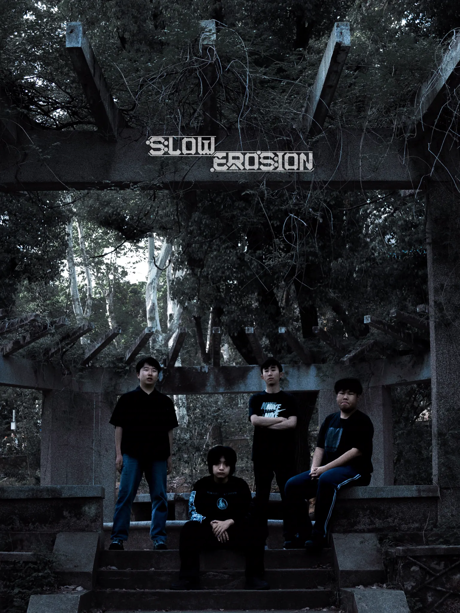
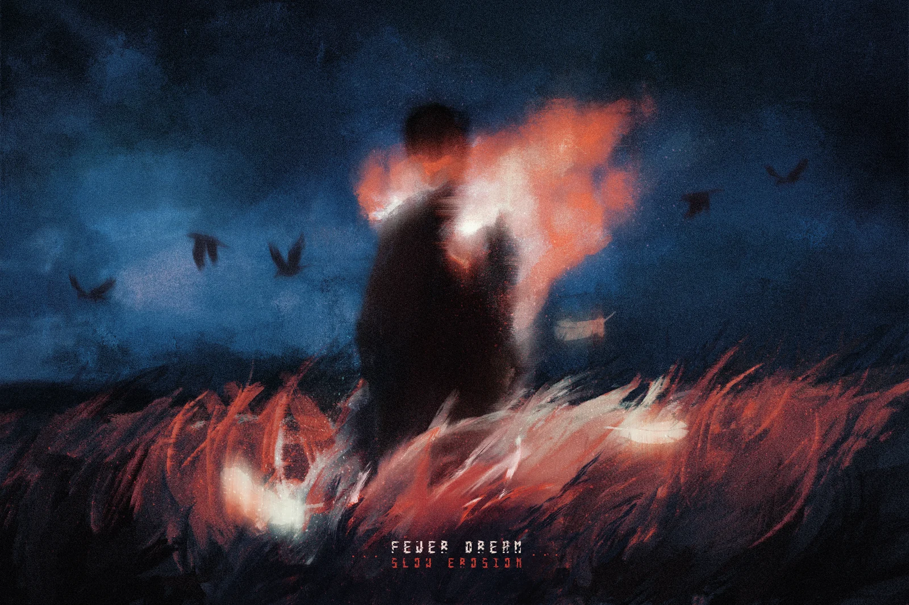

  

  <strong>A digital signal from Wuhan's dark metalcore underground.</strong>

  The official website of Slow Erosion — conceived as a damaged transmission, 
  an editorial archive, and a visual expression of gradual human corrosion.

  
  
  
  

  <a href="https://slow-erosion.asia/"><strong>ENTER THE OFFICIAL EXPERIENCE →</strong></a>

---

## Contents

- [A website imagined as signal failure](#a-website-imagined-as-signal-failure)
- [Creative thesis](#creative-thesis)
- [Narrative architecture](#narrative-architecture)
- [Visual system](#visual-system)
- [Motion is part of the meaning](#motion-is-part-of-the-meaning)
- [Interaction language](#interaction-language)
- [Photography as an archive](#photography-as-an-archive)
- [Bilingual by design](#bilingual-by-design)
- [Responsive atmosphere](#responsive-atmosphere)
- [Design engineering](#design-engineering)
- [The signal is live](#the-signal-is-live)

---

## A website imagined as signal failure

Slow Erosion is not presented as a conventional band biography with a hero image, a short introduction, and a list of links. The site is designed as a system that is already failing when the visitor arrives.

The interface borrows the language of broadcast diagnostics, surveillance readouts, damaged archives, and industrial control panels. Video decays into still imagery. Words reconstruct themselves from noise. Photography begins drained of color and regains life only when someone chooses to linger. Dates, coordinates, file labels, indices, and unstable system values make the band feel less like a product being promoted and more like a signal being recovered.

That concept comes directly from the name **Slow Erosion**: collapse does not happen in one spectacular instant. It arrives through repetition, pressure, numbness, and the gradual loss of agency. The website turns that idea into behavior.

> The end does not arrive with a bang. It comes as a low, prolonged sigh.

## Creative thesis

The design connects each part of the band's identity to a visible or interactive rule.

| Idea | Translation into the interface | Intended feeling |
| --- | --- | --- |
| **Gradual corrosion** | Scroll progress drives clipping, scale, image drift, contrast, and fractured signal blocks | The page appears to wear away rather than simply move |
| **Systemic pressure** | Coordinates, timestamps, indices, percentage readouts, grids, and terminal-like metadata | A human story trapped inside an impersonal machine |
| **Violence and dream** | Dense black, cold white, restrained signal red, blurred video, grain, and large moments of negative space | Brutality held inside something distant and cinematic |
| **Memory under distortion** | Live photography is desaturated until hover or attention allows color to bleed back | Presence temporarily revives what the archive has lost |
| **Wuhan origin** | Chinese and English coexist with location data instead of being separated into different sites | Local identity remains the source, not an afterthought |
| **Resistance** | Magnetic controls, custom cursor feedback, full-screen immersion, and direct streaming routes | The visitor can interrupt the system and act within it |

## Narrative architecture

The page is paced like one continuous transmission. Each section changes the visual density and interaction model while remaining part of the same signal.

| Stage | Experience | Narrative role |
| --- | --- | --- |
| **00 / Boot** | Logo film, loading percentage, system grid, and corrupted decode text | The visitor does not open a website; they establish a connection |
| **01 / Acquisition** | Full-screen performance film, oversized mark, Wuhan metadata, live clock, and unstable bitrate | Introduces the band as an atmosphere before offering information |
| **02 / Collapse** | Moving image contracts into a cold still frame while edges, blocks, and type erode with scroll | Makes the central concept physically visible |
| **03 / Human layer** | Bilingual manifesto, band portrait, member roster, and thematic keywords | Reveals the people and philosophy inside the machine |
| **04 / Field archive** | A 12-frame auto-cycling reel expands into a 31-image live archive | Converts performance history into recovered visual evidence |
| **05 / Evidence log** | 24 shows are documented as an indexed system ledger | Gives the visual world proof, chronology, and physical weight |
| **06 / Artifact** | *Fever Dream* appears as a recovered cover file with direct streaming routes | Turns the debut release into the transmission's central object |
| **07 / Open channel** | Social routes, WeChat window, and backstage message console | Ends with contact rather than a passive footer |

## Visual system

### Palette

The palette stays deliberately narrow so motion, photography, and typography carry the emotional variation.

| Token | Value | Role |
| --- | --- | --- |
| **Void black** | `#060606` | Primary spatial field; never fully neutral, always slightly textured |
| **Raw white** | `#F4F4F2` | Type, diagrams, borders, and exposed signal information |
| **Signal red** | `#C8141C` | Warnings, energy, selection, erosion, and moments of human intensity |
| **Archive grey** | `#8A8A88` | Secondary metadata and information receding into the system |
| **Bone accent** | `#D7D2C4` | A warmer counterpoint that keeps the monochrome world from feeling sterile |

The optional day mode inverts the system without abandoning its material character: black becomes paper-like off-white, while grid lines, grain, red accents, and editorial contrast remain intact.

### Typography

The type system intentionally behaves like two incompatible voices occupying the same interface:

- condensed display lettering creates the scale and aggression of a gig poster;
- monospaced UI text introduces machine precision, coordinates, file names, and status readouts;
- Chinese serif fallbacks preserve the weight and cadence of the band's original language;
- oversized words are clipped, repeated, decoded, and shifted so typography becomes image rather than caption.

### Composition

The desktop layout uses a persistent vertical index as both navigation and visual pressure. The content field remains cinematic and spacious, while the sidebar compresses labels into narrow poster-like forms. Thin rules, technical grids, corner marks, and deliberately uneven alignment make every section feel documented but unstable.

<table>
  <tr>
    <td width="58%"></td>
    <td width="42%"></td>
  </tr>
  <tr>
    <td><strong>Environmental scale</strong> Human figures are held inside ruined architecture, haze, and negative space.</td>
    <td><strong>Recovered artifact</strong> The release cover is treated as a file pulled from the same damaged archive.</td>
  </tr>
</table>

## Motion is part of the meaning

Animation is not used as decoration. Each motion describes how the fictional system behaves.

- **Boot once, remember afterward** — the intro sequence establishes the world on first contact, then respects the session instead of replaying endlessly.
- **Scroll-driven erosion** — a continuous corrosion value controls image scale, clipping geometry, contrast, block displacement, and the relationship between text and frame.
- **Text recovery** — headings decode from corrupted characters into readable language as they enter the viewport.
- **Controlled interruption** — glitch flashes are brief and irregular; the interface feels unstable without making content impossible to read.
- **Linger to restore** — live images begin cold and desaturated, then recover color when the visitor stays with them.
- **Magnetic response** — key controls lean subtly toward the pointer, making the system feel reactive without becoming playful.
- **Visibility-aware media** — video, carousel, and audio behavior respond to whether the page is actually being viewed.
- **Reduced-motion path** — visitors who request less motion receive the same information and structure without the full cinematic layer.

## Interaction language

| Interaction | Response |
| --- | --- |
| Move through the hero | The custom cursor, magnetic targets, grid, and live diagnostics make the frame feel instrumented |
| Scroll into **Erosion** | The moving transmission condenses into a fractured still image |
| Switch **ZH / EN** | The manifesto changes language in place, preserving a single shared composition |
| Hover over live photography | Color returns to the archival frame |
| Enter fullscreen | The site becomes an audiovisual environment rather than a browser document |
| Toggle day mode | The same system is reinterpreted as damaged paper and printed matter |
| Open *Fever Dream* | The recovered artifact becomes a direct route to NetEase Cloud Music or Spotify |
| Enter the contact console | WeChat and the backstage message channel turn the final section into an open line |

## Photography as an archive

The photo system avoids a single polished press gallery. It combines two rhythms:

1. a controlled 12-image reel that introduces the stage language through automatic pacing;
2. a longer field stream of uneven portrait, wide, smoke, crowd, motion, and edge frames.

Every image is labeled like captured evidence — `STAGE / FRONT`, `LIGHT / GRAIN`, `CROWD / NOISE`, `VERTICAL / MOTION`. The labels remove the distance between interface and image: the gallery becomes part of the same diagnostic system instead of a separate content block.

## Bilingual by design

Chinese is the emotional source language of the project. English broadens the transmission without replacing that source.

The band manifesto can switch languages inside a stable editorial frame, while names, location, platform labels, and recurring phrases remain intentionally bilingual. This creates a site that feels rooted in Wuhan yet legible to an international heavy-music audience.

## Responsive atmosphere

The mobile experience is recomposed rather than merely reduced:

- the fixed desktop index becomes a dedicated mobile navigation layer;
- media selects a mobile-specific background treatment where appropriate;
- the footer becomes a cinematic closing frame with its own moving image;
- editorial type, metadata, controls, and contact routes retain their hierarchy on narrow screens;
- touch users receive direct controls without depending on hover-only behavior.

The visual intensity is balanced by semantic landmarks, a skip link, visible keyboard focus, descriptive labels, structured live-history rows, meaningful image alternatives, and a reduced-motion mode.

## Design engineering

The experience is built with a deliberately direct stack: semantic HTML, a custom CSS visual system, and framework-free JavaScript. That keeps the relationship between concept and behavior close — scroll position can become corrosion, focus can become signal recovery, and every visual rule remains authored for this specific band rather than inherited from a component library.

The same design system coordinates:

- desktop and mobile video treatments;
- session-aware preloading;
- intersection-based reveal and decode states;
- adaptive day and night themes;
- fullscreen audio behavior;
- the live-photo carousel and archive;
- streaming, social, WeChat, and backstage contact routes.

## The signal is live

  <a href="https://slow-erosion.asia/"><strong>slow-erosion.asia</strong></a>  
  Wuhan, China · Metalcore · Established 2023 
  Debut single: <strong>Fever Dream</strong>

---

  <strong>Visual direction, interaction design, and build by Shay Chen.</strong> 
  An independent digital home for Slow Erosion.

