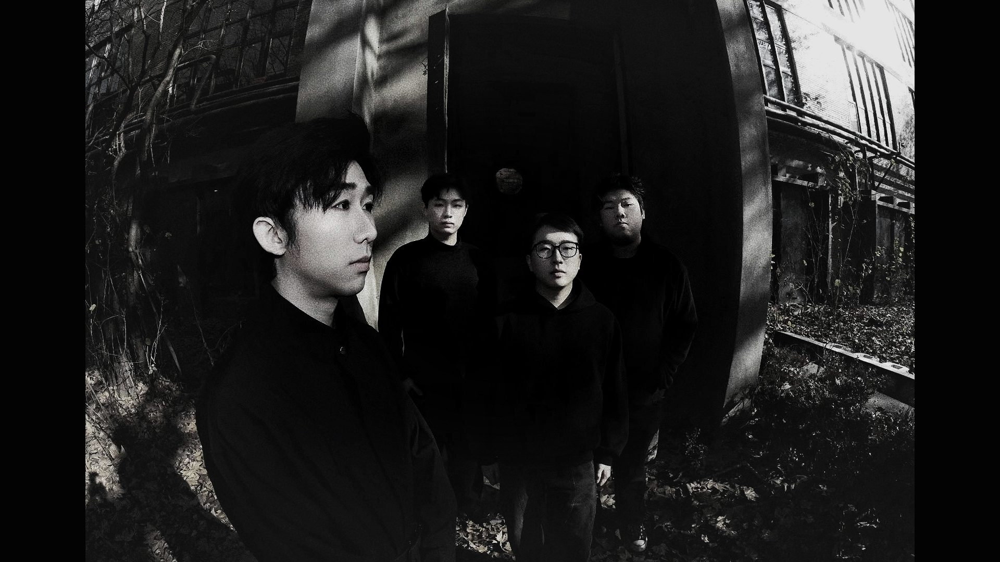

  

  <strong>A digital signal from Wuhan's dark metalcore underground.</strong>

  <a href="https://slow-erosion.asia/"><strong>ENTER THE OFFICIAL WEBSITE →</strong></a>

## The Experience

The official Slow Erosion website is designed as a corrupted broadcast rather than a conventional band profile. Moving image, signal noise, fractured type, and stark editorial layouts turn the band's world into a continuous audiovisual narrative—cold, oppressive, dreamlike, and alive.

The experience moves from cinematic introduction to band story, live archive, performance history, and the debut single **Fever Dream**. Every section behaves like another recovered fragment from the same damaged transmission.

## Design Language

- **Signal-loss identity** — system readouts, scanlines, grain, glitches, and eroding image treatments translate the band's themes into interface behavior.
- **Monochrome tension** — deep black, raw white, and a restrained signal red create the visual pressure of modern metal while preserving clarity.
- **Editorial scale** — oversized condensed typography collides with compact monospace metadata, giving each page the rhythm of a poster and the precision of an archive.
- **Cinematic motion** — full-screen video, scroll-led transitions, image corrosion, custom cursor feedback, and magnetic controls make browsing feel performative.
- **Bilingual voice** — Chinese and English storytelling keeps the band's Wuhan identity intact while opening the work to an international audience.
- **Responsive atmosphere** — desktop and mobile compositions retain the same visual weight, pacing, and sense of controlled instability.

## Inside the Signal

The site brings together the band's origin and philosophy, member profiles, live photography, a 24-show performance log, streaming links for **Fever Dream**, video channels, and direct contact paths in one immersive sequence.

  <a href="https://slow-erosion.asia/"><strong>slow-erosion.asia</strong></a> 
  Wuhan, China · Metalcore · Est. 2023

